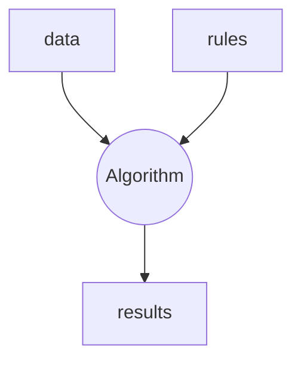
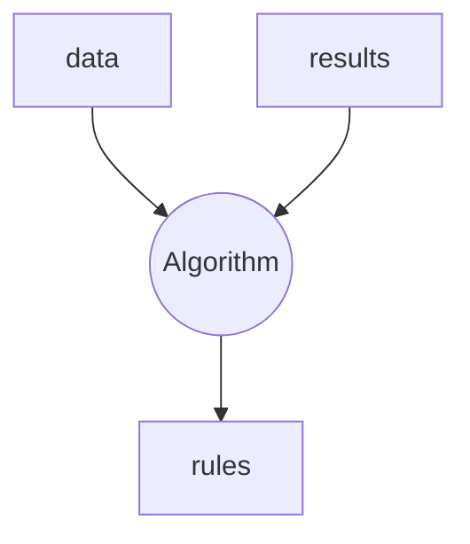

# Understand the problem

We have a **classification problem**: we have some data and the class they belong to (is a **supervise problem**). We want to obtain a **model that given data (we do not they class they really belongs to) tell us, what is the most probably class their belongs to**.

In classic programming:

In our machine learning context (supervised) the paradigm is different:

In order to create this **classifier** we need a few elements:

1. Known the **problem we want to answer**, that is **the question we want our classifier to answer**.

> In this case we want to create a classifier that returns the most likely digit from the given imput (a 8x8 matrix that represents the pixels of a handwritten digit from 0 to 9). So we want to create a **10-class classifier**. 
> How do we penalize failure? Do we want to be equally precisse on all digits or do we want to penalize more one digit's error than another's one? Are the classes balanced (that means that we have similar number of elements for all classes)? The answers of all these questions will be relevant later.

2. Data to learn from
3. Algorithm to generate this classifier. This process will be called **training** or **fitting**. This classifier is what we will call **a model** once is trained.
4. A way to measure how well we are going. In general this will call **fitness function**. 
 
Depending on the type of data we will have different options for algorithms and depending of the nature (we will talk more about this later) of the problem some fitness functions will be more appropiate than others.

## Understanding the results

From the different metrics that we can use, we are going to use the **accuracy** for being very appropiate for this balanced problem. We can derive its formula from the **confusion matrix**:

<table>
    <tr>
        <td>
            <ul><li>True positive (**TP**)</li></ul> 
        </td>
        <td>
            <ul><li>False Negative (**FN**)</li><li>aka. **Type II error**</li></ul>
        </td>
    </tr>
    <tr>
        <td>
            <ul><li>False positive (**FP**)</li><li>aka. **Type I error**</li></ul>
        </td>
        <td>
            <ul><li>True Negative (**TN**)</li></ul>
        </td>
    </tr>
</table>

$$
Accuracy = \frac{
    TP + TN
}{
    TP + TN + FP + FN
}
$$

## The algorithms

We have a time limit for today's session, so we are going to limit ourselves to a pair of algorithms.

# Action plan

1. Get the dataset
2. Understand it and prepare it
    1. Study if is a balance problem or not 
    2. Study of missing values and outliers and their treatment (not today)
    3. Feature engineering (standarization, creation of new variables, ...)
    4. Encoding
3. Train models