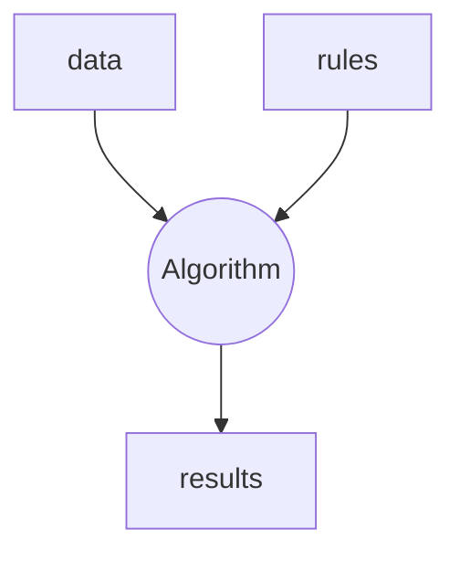
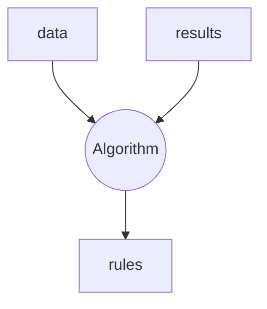

# Understand the problem

We have a **classification problem**: we have some data and the class they belong to (is a **supervise problem**). We want to obtain a **model that given data (we do not they class they really belongs to) tell us, what is the most probably class their belongs to**.

In classic programming:



In our machine learning context (supervised) the paradigm is different:



In order to create this **classifier** we need a few elements:

1. Known the **problem we want to answer**, that is **the question we want our classifier to answer**.

> In this case we want to create a classifier that returns the most likely digit from the given imput (a 8x8 matrix that represents the pixels of a handwritten digit from 0 to 9). So we want to create a **10-class classifier**. 
> How do we penalize failure? Do we want to be equally precisse on all digits or do we want to penalize more one digit's error than another's one? Are the classes balanced (that means that we have similar number of elements for all classes)? The answers of all these questions will be relevant later.

2. Data to learn from
3. Algorithm to generate this classifier. This process will be called **training** or **fitting**. This classifier is what we will call **a model** once is trained.
4. A way to measure how well we are going. In general this will call **fitness function**. 
 
Depending on the type of data we will have different options for algorithms and depending of the nature (we will talk more about this later) of the problem some fitness functions will be more appropiate than others.

## Understanding the results

From the different metrics that we can use, we are going to use the **accuracy** for being very appropiate for this balanced problem. We can derive its formula from the **confusion matrix**:

<table>
    <tr>
        <td>
            <ul><li>True positive (<b>TP</b>)</li></ul> 
        </td>
        <td>
            <ul><li>False Negative (<b>FN</b>)</li><li>aka. <b>Type II error</b></li></ul>
        </td>
    </tr>
    <tr>
        <td>
            <ul><li>False positive (<b>FP</b>)</li><li>aka. <b>Type I error</b></li></ul>
        </td>
        <td>
            <ul><li>True Negative (<b>TN</b>)</li></ul>
        </td>
    </tr>
</table>

$$
Accuracy = \frac{
    TP + TN
}{
    TP + TN + FP + FN
}
$$

## The algorithms

We have a time limit for today's session, so we are going to limit ourselves to a pair of algorithms.
* **Decission tree classifier**: the simples one today. Very use due to its high interpretability.
* **Random forest classifier**: is an ensemble, that is a combination of smaller models. In this case all these models will be decission trees.

# Action plan

1. Get the dataset
   * Use the Kaggle API or download it directly
   
2. Understand the dataset and prepare it for the next steps (```preprocessing.ipynb```)
    1. Study if is a balance problem or not
    2. Study of missing values and outliers and their treatment (not today)
    3. Feature engineering (standarization, creation of new variables, ...) (not today)
    4. Encoding (not necessary today)
3. Train models (```train.py```)

We are going to add MLFlow tracking only from step 3.

***

## Inlcuding MLFlow for tracking training process

1. Install MLFlow and init the server at the desired port:
    ```pip install mlflow```

    ```mlflow server --host 127.0.0.1 --port 8080```
2. Lets import the library and create an experiments for grouping data.
   ```python
    # Import the library
    import mlflow

    # Connect to the MLflow server (in this case, we are using our own computer)
    mlflow.set_tracking_uri(uri="http://localhost:8080")

    # Set the tracking experiment (in this case, House Prices is going to be our experiment name)
    mlflow.set_experiment("PythonBCN 2024")
    ```
3. Register the model by starting a mlflow_run :point_right: Lets see code!

# References

About the dataset and Kaggle API:

* [MNIST's Wikipedia article](https://en.wikipedia.org/wiki/MNIST_database).
* [Kaggle's API documentation](https://www.kaggle.com/docs/api).

Measuring how the training is doing:

* [Classification: Accuracy, recall, precision, and related metrics](https://developers.google.com/machine-learning/crash-course/classification/accuracy-precision-recall)

About the algorithms we've used, check the list of hyperparameters to continue experimenting or try different ones:

* [Random Forest Classfier documentation](https://scikit-learn.org/1.5/modules/generated/sklearn.ensemble.RandomForestClassifier.html)
https://mlflow.org/docs/latest/python_api/mlflow.html
* [Decision Tree Classifier documentation](https://scikit-learn.org/stable/modules/generated/sklearn.tree.DecisionTreeClassifier.html)

References about MLFlow to continue learning:

* [MLFlow official guide](https://mlflow.org/docs/latest/getting-started/index.html).
* [MLflow, Quick Start Guide](https://medium.com/@jordioltra2/mlflow-quick-start-guide-b556fff4e218): this is a great medim article.
