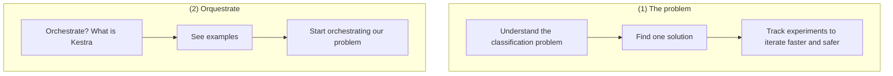

# Automate end to end MLflow with Kestra and MLFlow (PyData 2024 BCN - Workshop)

**Abstract**: During this session we are going to create a whole ML pipeline, from gathering and prepare the data to train different models and perform inference. We will use a Kaggle competition as our use case. We will learn the basics of Kestra, an orchestration platform, and MLFlow, a tool for keeping track of all processes relative to the full lifecycle for machine learning projects. We are going to use these tools to download a dataset from Kaggle, analyse it, process it, train different models by using different algorithms, perform inference on submission samples, and automatically upload the results back to Kaggle.

## Goals for today

1. Solve a simple classification problem
2. Include MLFlow to track experimentations
3. Learn how to start with Kestra to automatize tasks

## Planning for today's sesssion

